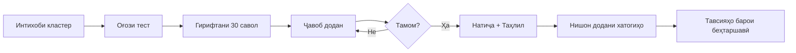
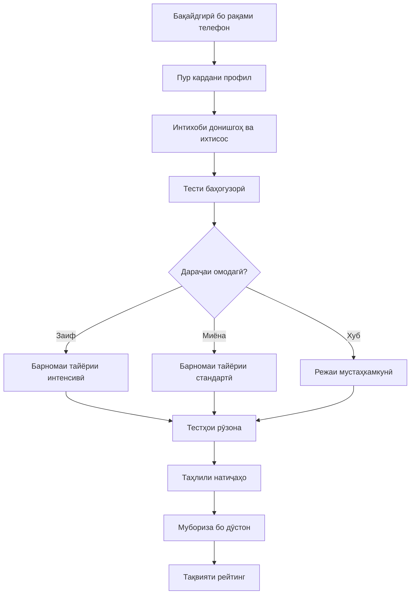
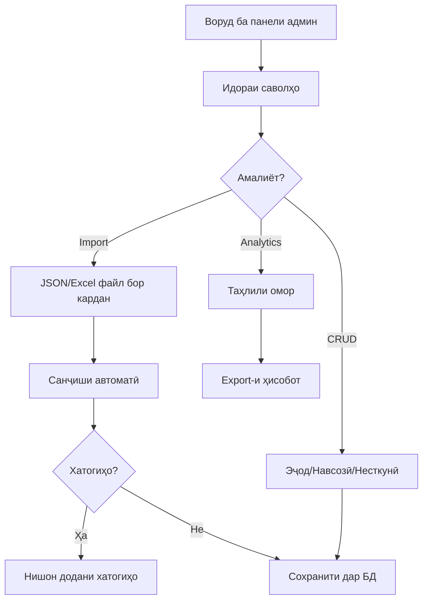

# 📚 IQRA Platform - Платформаи Омӯзиши Тоҷикистон

> **Платформаи онлайни тайёрии давлатии имтиҳонҳои қабулӣ ба донишгоҳҳои Тоҷикистон**


---

## 🎯 Мақсади Лоиҳа

### Мушкилиҳое, ки ҳал мекунем

**1️⃣ Дастрасии маҳдуд ба маводи сифатнок**

- Донишҷӯёни деҳот ва минтақаҳои дурдаст ба курсҳои омӯзишии сифатнок дастрасӣ надоранд
- Китобҳо ва маводи чопӣ гаронарз ва дар ҳама ҷо дастрас нестанд
- Курсҳои офлайн (репетитор) барои бисёр оилаҳо нархаш баланд аст

**2️⃣ Тайёрии стандартизатсия нашуда**

- Донишҷӯён намедонанд, ки чӣ гуна дуруст тайёрӣ бубинанд
- Фаҳмиши дараҷаи омодагӣ душвор аст
- Бозхӯрӣ (feedback) оиди заъфиҳо вуҷуд надорад

**3️⃣ Маълумоти кофӣ дар бораи донишгоҳҳо**

- Донишҷӯён намедонанд, ки кадом донишгоҳ ва ихтисос барои онҳо мувофиқ аст
- Балли минималӣ барои ҳар ихтисос номаълум аст
- Маълумот дар бораи кластерҳо ва тақсимоти фанҳо пароканда аст

### Ҳалли мо

IQRA Platform як системаи ягонаи омӯзишӣ мебошад, ки:

✅ **Дастрасии умумӣ** - 24/7 аз ҳар ҷои Тоҷикистон бо интернет  
✅ **Ройгон** - Маводи асосӣ барои ҳама ройгон  
✅ **Персонализатсия** - Тайёрӣ мутобиқи заъфиҳои шахсӣ  
✅ **Гамификатсия** - Омӯзиш бо рӯҳияи рақобат ва шавқ  
✅ **Маълумоти ҷомеъ** - Ҳамаи донишгоҳҳо ва ихтисосҳо дар як ҷой  

---

## 🌟 Хусусиятҳои Асосӣ

### 1. Системаи Тестгузорӣ 📝

**Чӣ гуна кор мекунад:**

Донишҷӯён метавонанд:

- **Тестҳои тамринӣ** (Practice Mode) - бе маҳдудият ва таймер
- **Тестҳои симулятсияи ДМТ** (Exam Mode) - шабеҳи ДМТ-и воқеӣ
- **Мубориза бо дӯстон** (Duel Mode) - рақобат дар вақти воқеӣ

**Намунаи ҷараён:**



**Мисол:**
Донишҷӯй барои ихтисоси "Муҳандисии барқ" тайёрӣ мебинад:

1. Кластери 1 (Математика, Физика, Забони англисӣ) интихоб мекунад
2. Тести 30 саволӣ мегирад (15 мат, 10 физика, 5 англисӣ)
3. Баъд аз ҷавоб, таҳлили муфассал мегирад:
   - "Математика: 12/15 (80%) ✅"
   - "Физика: 6/10 (60%) ⚠️ - Механика заиф"
   - "Англисӣ: 4/5 (80%) ✅"

### 2. Системаи Таҳлили Хатогиҳо 📊

**Чӣ гуна кор мекунад:**

Барои ҳар донишҷӯ:

- **Банки хатогиҳо** (MistakeBank) эҷод мешавад
- Ҳар хатогӣ бо фан ва мавзуъ сабт мешавад
- Саволҳои такрорӣ барои мустаҳкамкунӣ пешниҳод мешаванд

**Мисол:**

```
Мавзуъи заиф: "Физика → Механика → Қонунҳои Нютон"
Хатогиҳо: 5 маротиба
Тавсия: "2 соли гузашта 78% донишҷӯён дар ин мавзуъ хато мекунанд.
         Мо 15 савол барои тамрин пешниҳод мекунем."
```

### 3. Маълумоти Донишгоҳҳо 🎓

**Пойгоҳи маълумот:**

- 4+ донишгоҳи асосӣ (ДМТ, ДТТ, ДАДИ, ДДМТ)
- 50+ ихтисос бо балли минималӣ
- 5 кластер бо тақсимоти фанҳо

**Мисол:**

```
Донишгоҳ: ДМТ (Донишгоҳи Миллии Тоҷикистон)
Факултет: Муҳандисӣ
Ихтисос: Муҳандисии барқ
Кластер: 1 (Мат 50%, Физика 33%, Англисӣ 17%)
Балли минималӣ 2024: 165
Балли минималӣ 2025: 170
Ҷойҳои давлатӣ: 50
```

### 4. Системаи Рейтингҳо 🏆

**Чӣ гуна кор мекунад:**

Донишҷӯён дар лигаҳо (Bronze, Silver, Gold, Platinum, Diamond) ҷудо мешаванд:

```
Лига          | Балл      | Имтиёзҳо
--------------|-----------|---------------------------
🥉 Bronze     | 0-999     | Тестҳои асосӣ
🥈 Silver     | 1000-2499 | Таҳлили хатогиҳо
🥇 Gold       | 2500-4999 | Режаи махсус
🏆 Platinum   | 5000-9999 | Мубориза бо беҳтаринҳо
💎 Diamond    | 10000+    | Profile-и махсус
```

**Тарзи гирифтани балл:**

- Ҷавоби дуруст: +10 балл
- Тести тамом: +50 балл
- Бурд дар мубориза: +100 балл
- Streak 7 рӯз: +200 балл

### 5. Системаи Мубориза (Duel) ⚔️

**Чӣ гуна кор мекунад:**

1. Донишҷӯ дӯстро даъват мекунад
2. Ҳарду 10 савол дар як вақт ҷавоб медиҳанд
3. Бо суръат ва дуруст балл ҷамъ мекунанд
4. Бурдакунанда +100 балл, бохтакунанда +25 балл

**Мисол:**

```
Донишҷӯй А:  8/10 дуруст (45 сония) → 880 балл
Донишҷӯй Б:  9/10 дуруст (60 сония) → 800 балл
Бурдакунанда: Донишҷӯй А ✅
```

---

## 🏗️ Меъмории Техникӣ

### Сохтори Лоиҳа (Clean Architecture)

```
┌─────────────────────────────────────────┐
│           WebApp (API Layer)            │
│  Controllers, Middleware, Extensions    │
└─────────────────────────────────────────┘
                    ↓
┌─────────────────────────────────────────┐
│       Application (Business Logic)      │
│      Interfaces, DTOs, Services         │
└─────────────────────────────────────────┘
                    ↓
┌─────────────────────────────────────────┐
│     Infrastructure (Data Access)        │
│   Services, Repositories, Database      │
└─────────────────────────────────────────┘
                    ↓
┌─────────────────────────────────────────┐
│          Domain (Core Logic)            │
│        Entities, Enums, Rules           │
└─────────────────────────────────────────┘
```

### Технологияҳо

| Самт | Технология | Сабаб |
|------|-----------|-------|
| **Backend** | .NET 10 | Тезӣ, амнияти баланд, дастгирии блокировки |
| **Database** | SQL Server | Боэътимод, мувофиқ барои структураи мураккаб |
| **Authentication** | JWT Tokens | Stateless, масштабпазир |
| **SMS** | OsonSMS | Интеграсияи маҳаллӣ |
| **API Docs** | Swagger/OpenAPI | Тестгирӣ ва ҳуҷҷатнигорӣ |

### Базаи Маълумот

**Ҷадвалҳои асосӣ:**

```sql
-- Корбарон
Users (Id, FullName, PhoneNumber, Region...)
UserProfiles (UserId, TargetUniversity, CurrentLeague...)

-- Омӯзиш
Questions (Id, Content, SubjectId, Type, Difficulty)
AnswerOptions (Id, QuestionId, Text, IsCorrect)
TestSessions (Id, UserId, TestMode, StartTime...)
UserAnswers (Id, SessionId, QuestionId, Answer...)

-- Маълумоти Reference
Universities (Id, Name, Region, Type)
Majors (Id, UniversityId, Name, MinScore...)
ClusterDefinitions (Id, ClusterNumber, SubjectDistribution)

-- Analytics
MistakeBank (UserId, QuestionId, MistakeCount...)
UserProgress (UserId, SubjectId, Score, Date...)
```

---

## 📱 Тарҳи Истифодабарӣ

### Донишҷӯй (Student Flow)



### Муаллим/Админ (Admin Flow)



---

## 🔐 Амният ва Махфият

### Аутентификатсия

**3-қадамаи амният:**

1. SMS OTP (6 рақам, муҳлати 5 дақиқа)
2. JWT Token (муҳлати 24 соат)
3. Refresh Token (барои давомдорӣ)

### Ҳифзи маълумот

- **Encryption:** Рақамҳои телефон ва маълумоти шахсӣ рамзгузорӣ мешавад
- **Authorization:** Нақшҳои корбар (Admin, Teacher, Student)
- **Rate Limiting:** Маҳдудияти дархостҳо барои пешгирии ҳамла
- **Audit Log:** Сабти ҳамаи амалиётҳои муҳим

---

## 📈 Roadmap - Нақшаи Рушд

### ✅ Фаза 0: Асосгузорӣ (ТАМОМ)

- [x] Entities ва Database Schema
- [x] Reference Data (Донишгоҳҳо, Кластерҳо)
- [x] Authentication System (SMS OTP + JWT)
- [x] Admin Seeding

### ✅ Фаза 1: Системаи Тестгузорӣ (ТАМОМ)

- [x] TestTemplate Entity (5 кластер)
- [x] Question Management (Import/CRUD)
- [x] Test Service (Start/Submit/Finish)
- [x] 3 навъи савол (SingleChoice, Matching, ClosedAnswer)
- [x] API Endpoints (19 endpoints)

### 🎯 Фаза 2: Analytics & Таҳлил (ДАР ҶАР��ӮН)

- [ ] MistakeBank Entity
- [ ] Subject Performance Tracking
- [ ] Personalized Recommendations
- [ ] Progress Dashboard
- [ ] Export Reports (PDF/Excel)

**Мӯҳлат:** 2-3 рӯз

### ⏳ Фаза 3: Гамификатсия

- [ ] League System (Bronze → Diamond)
- [ ] Points & Rewards
- [ ] Daily Streaks
- [ ] Achievements & Badges
- [ ] Leaderboards

**Мӯҳлат:** 1 ҳафта

### ⏳ Фаза 4: Системаи Мубориза (Duel)

- [ ] Real-time Matchmaking
- [ ] Live Score Updates (SignalR)
- [ ] Duel History
- [ ] Tournament Mode
- [ ] Friend Challenges

**Мӯҳлат:** 1.5 ҳафта

### ⏳ Фаза 5: Шабакаи Иҷтимоӣ

- [ ] User Profiles (Public/Private)
- [ ] Friend System
- [ ] Study Groups
- [ ] Discussion Forums
- [ ] Mentor Matching

**Мӯҳлат:** 2 ҳафта

### ⏳ Фаза 6: Mobile Apps

- [ ] Android App (Flutter/React Native)
- [ ] iOS App
- [ ] Offline Mode
- [ ] Push Notifications
- [ ] App Store Release

**Мӯҳлат:** 1 мох

---

## 📊 Оморҳо ва Метрикаҳо

### Ҳадафҳои Мо (6 моҳаи аввал)

| Метрика | Ҳадаф |
|---------|-------|
| 👥 Корбарони фаъол | 10,000+ донишҷӯ |
| 📝 Саволҳо дар БД | 5,000+ савол |
| 🎯 Донишгоҳҳо | Ҳамаи донишгоҳҳои давлатӣ |
| 🏆 Тестҳои гузаронидашуда | 100,000+ тест |
| ⭐ Рейтинги корбарон | 4.5+ (аз 5) |

### KPIs (Key Performance Indicators)

```
Engagement:
- Daily Active Users (DAU): Target 30% of MAU
- Test Completion Rate: Target 80%
- Return Rate: Target 60% (7-day)

Quality:
- Question Accuracy: 95%+
- User Satisfaction: 4.5+/5
- Bug Reports: < 5 per week

Growth:
- Month-over-Month Growth: 20%+
- Referral Rate: 15%+
- Conversion (Free → Premium): 5%+
```

---

## 💰 Модели Даромад (Ояндадор)

### Версияи Ройгон (Free Tier)

✅ 10 тести рӯзона  
✅ Таҳлили асосӣ  
✅ Маълумоти донишгоҳҳо  
❌ Мубориза (3 дар рӯз)  
❌ Таҳлили муфассал  

### Версияи Premium ($3/моҳ)

✅ Тестҳои номаҳдуд  
✅ Таҳлили пеш�рафта бо AI  
✅ Мубориза бе маҳдудият  
✅ Режаи тайёрии шахсӣ  
✅ Видеодарсҳо ва маводи иловагӣ  

### Барои Муассисаҳои Омӯзишӣ ($50/моҳ)

✅ Ҳамаи хусусиятҳои Premium  
✅ Панели муаллим  
✅ Таҳлили синф/хундагар  
✅ Моҳони муқоисавӣ  
✅ Дастгирии техникӣ  

---

## 🌍 Таъсири Иҷтимоӣ

### Гурӯҳи Ҳадаф

```
Асосӣ: Хатмкунандагони синфи 11-ум (15,000+ ҳар сол)

Иловагӣ:
- Донишҷӯёни колеҷ
- Донишҷӯёне, ки имтиҳонро такрор медиҳанд
- Шахсоне, ки малакаҳоро такмил медиҳанд
```

### Манфиатҳо барои ҷомеа

🎓 **Дастрасии баробар** - Донишҷӯёни деҳот ҳамчун донишҷӯёни шаҳрӣ имконият доранд  
💡 **Хариҷоти паст** - Сарфи маблағ 10x камтар аз курсҳои офлайн  
📈 **Натиҷаҳои беҳтар** - Тайёрии мақсаднок балли қабулиро 20-30% афзоиш медиҳад  
🤝 **Созандагии ҷамъиятӣ** - Донишҷӯён яке ба дигар кӯмак мекунанд  

---

## 🚀 Оғоз кардан

### Барои Донишҷӯён

1. **Насб:** App-ро аз Google Play/App Store насб кунед
2. **Бақайдгирӣ:** Рақами телефон + SMS OTP
3. **Профил:** Донишгоҳ ва ихтисоси мақсадро интихоб кунед
4. **Тести баҳогузорӣ:** Дараҷаи омодагиро муайян кунед
5. **Оғози омӯзиш:** Ҳар рӯз тестҳо гузаронед ва пешравӣ кунед!

### Барои Developers

```bash
# 1. Clone repository
git clone https://github.com/your-org/iqra-platform.git

# 2. Setup database
dotnet ef database update

# 3. Configure appsettings
# - ConnectionString
# - JWT Secret
# - SMS API credentials

# 4. Run
dotnet run --project WebApp

# 5. Access Swagger
https://localhost:5001/swagger
```

### Барои Муаллимон/Админҳо

1. **Воруд:** `admin` / `Admin@123` (тағйир диҳед!)
2. **Import саволҳо:** JSON ё Excel файл
3. **Таҳияи тестҳо:** Интихоби фан, дараҷа, навъ
4. **Мониторинг:** Таҳлили натиҷаҳои донишҷӯён
5. **Ҳисоботҳо:** Export дар PDF/Excel

---

## 🛠️ Дастгирӣ ва Ҳуҷҷатҳо

### Барои истифодабарон

- 📖 [Роҳнамои корбар](docs/user-guide.md)
- ❓ [FAQ - Саволҳои зиёд пур��сида](docs/faq.md)
- 🎥 [Видеодарсҳо](https://youtube.com/@iqra-tj)
- 💬 Telegram: [@iqra_support](https://t.me/iqra_support)

### Барои developers

- 🔧 [API Documentation](docs/api.md)
- 📚 [Architecture Guide](docs/architecture.md)
- 🧪 [Testing Guide](docs/testing.md)
- 🐛 [Contributing](CONTRIBUTING.md)

---

## 👥 Дастаи Лоиҳа

**Roles:**

- **Product Owner:** Ташаббуси лоиҳа ва vision
- **Backend Lead:** .NET Architecture ва API
- **Frontend Lead:** Mobile/Web UI
- **Database Admin:** SQL Server ва Performance
- **DevOps:** Deployment ва CI/CD
- **Content Creators:** Саволҳо ва маводи омӯзишӣ

**Муттаҳидон:**

- Вазорати маориф ва илми ҶТ
- Донишгоҳҳои давлатӣ
- Ташкилотҳои ғайридавлатӣ

---

## 📜 Литсензия ва Истифода

**License:** Proprietary - IQRA Platform © 2026

**Қоидаи истифода:**

- ✅ Шахсӣ (ройгон)
- ✅ Омӯзишӣ (бо иҷозат)
- ❌ Тиҷоратӣ (бе иҷозат)
- ❌ Redistribution (манъ)

**Privacy Policy:**

- Маълумоти шахсӣ ҳифз мешавад
- Маълумот ба тарафи сеюм дода намешавад
- Истифодабарон ҳуқуқи несткунии маълумот доранд

---

## 📞 Тамос

**Офис:**  
Душанбе, кӯчаи Рӯдакӣ 123  
Толеронӣ: +992 XX XXX XXXX

**Онлайн:**

- 🌐 Website: [iqra.tj](https://iqra.tj)
- 📧 Email: <info@iqra.tj>
- 💬 Telegram: [@iqra_platform](https://t.me/iqra_platform)
- 📱 Instagram: [@iqra.tj](https://instagram.com/iqra.tj)

**Кор бо мо:**  
Агар шумо муаллими ботаҷриба, developer, ё designer ҳастед ва мехоҳед дар ин лоиҳа иштирок кунед:  
📩 <careers@iqra.tj>

---

## 🙏 Миннатдорӣ

Ин лоиҳа бо дастгирии:

- Донишҷӯёни ҷонибдори маълумот
- Муаллимони ботаҷриба
- Ҷомеаи Open Source
- Оилаҳое, ки ба маориф аҳамият медиҳанд

эҷод шудааст.

---

<div align="center">

**Биёед якҷоя ояндаи дурахшонтар барои ҷавонони Тоҷикистон созем! 🇹🇯**

Made with ❤️ in Tajikistan

</div>
